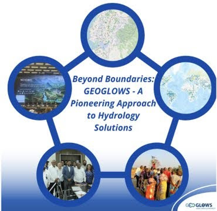

## Learning from Previous Experiences 

We hope to develop an effective system of implementation of the Theory of Change in a more robust manner, taking advantage of the global model GEOGLOWS which is cost-effective compared to running a local model.

Figure 9. Expanding GEOGLOWS

[For stories, click **here**.](https://stories.geoglows.org/home)