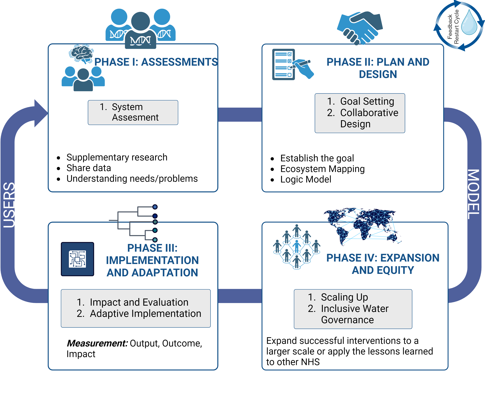
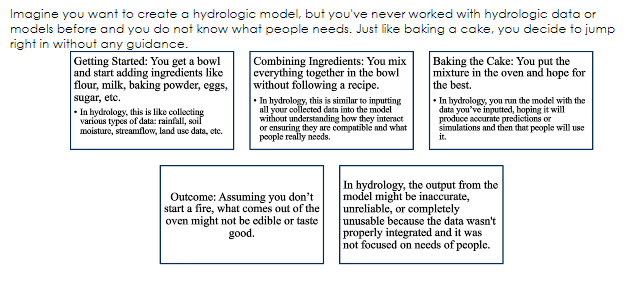
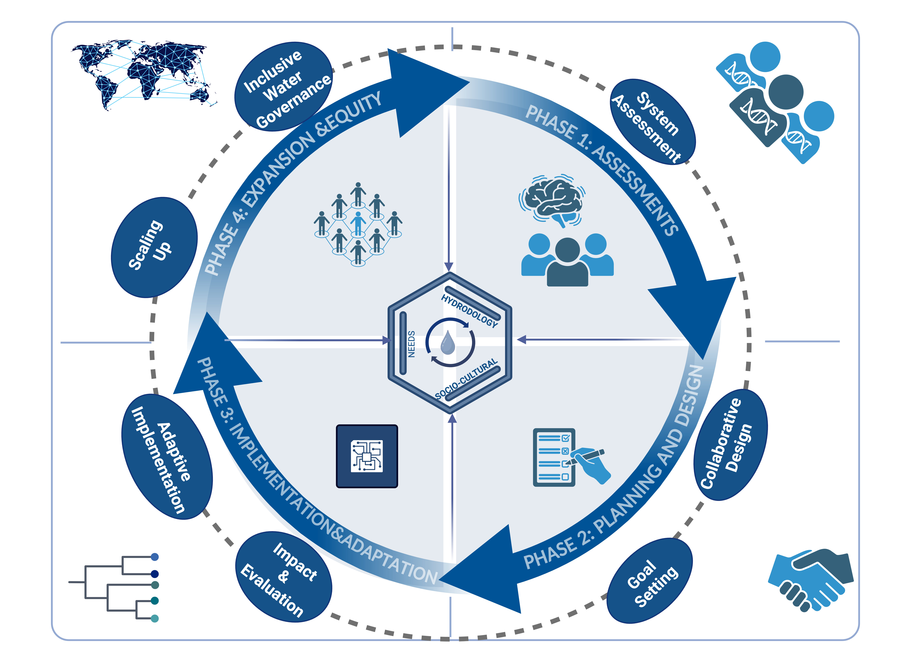
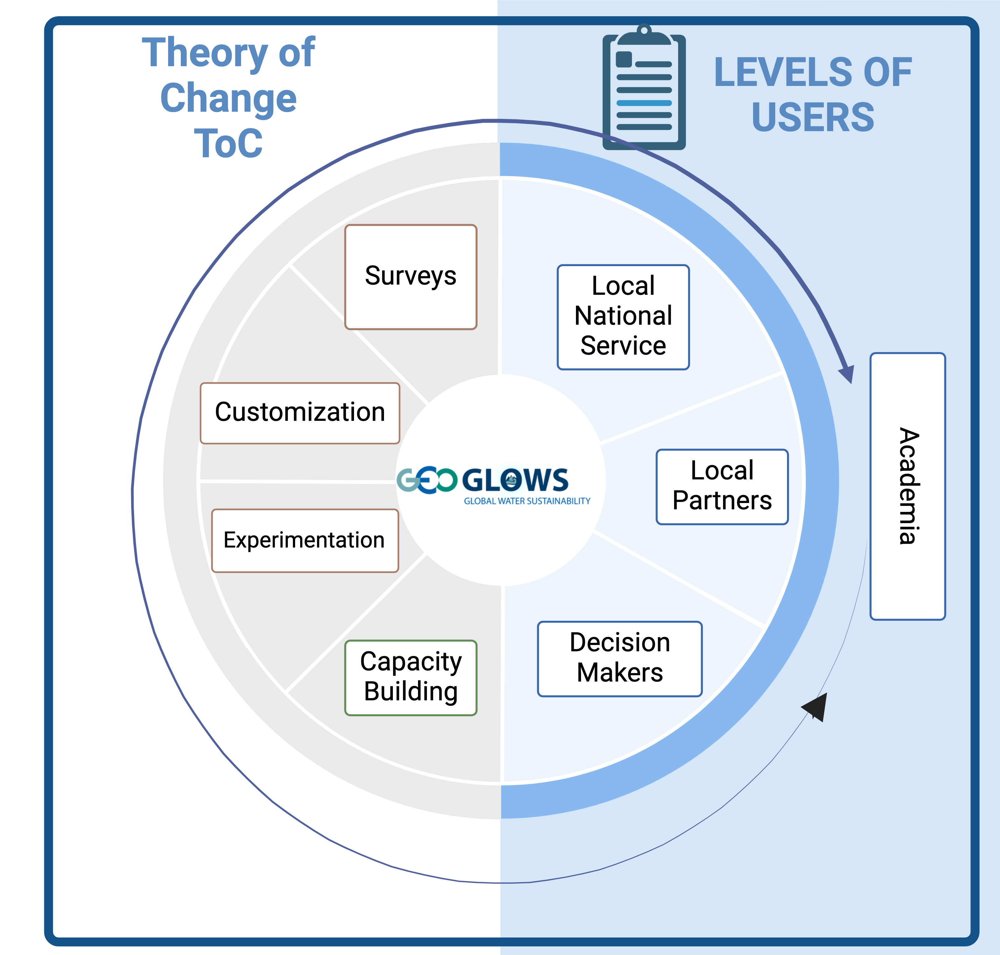

## THE SOCIAL IMPACT MODEL FOR GLOBAL HYDROLOGICAL MODELS

This involves actively involving local communities and stakeholders in the co-creation process, ensuring their needs and knowledge are integrated into the model. By doing so, the models can become more relevant, useful, and effective in addressing the specific hydrological challenges faced by different communities.

The Social Impact Model for Hydrology Modeling  will  help to understand and measure the societal impact of a co-created global hydrological model. This focuses on having an organized plan that dives deeper into how a given intervention is expected to trigger a chain of results that leads to achieving the outcome goal.

To initiate this process, consider the following questions:

- How do we know that the model is good enough?
- What will you improve?
- What problem will you address?
- What steps will you take?
- How will you measure success?
- How can you increase impact?
- How do you know your model is creating impact?
- Are you sure your model is useful?
- How do you know it is useful?

The Social Impact Model for Hydrology Modeling will encompass two main directions, as illustrated in Figure 2. The initial phase of the Social Approach emphasizes establishing a deeper collaboration with National Hydrological Services (NHS) as key stakeholders, utilizing the GEOGLOWS model as the operational tool. Once the implementation and adaptation phases are completed, the NHS will take the lead in expanding and ensuring equitable use of the model.

### **KEY SUMMARY OF THE SECTION**

 Theory of Change shows what needs to happen to achieve our goals. 

Using the Social Impact Model will allow changemakers to measure impact while also creating a relationship between the collaborator and the stakeholder. 

This approach is divided into 4 phases:

1. Assessment
2. Planning & Design
3. Implementation & Adaptation
4. Expansion & Equity

Figure 2. Social Impact Model for Global Hydrology 

The Social Impact Cycle for Global Model Hydrology is based on the slogan “Love the Problem, Not the Solution”. This allows change makers to turn their focus less on the solution, addressing the solution based on a deeper understanding of the problem by creating meaningful relationships with the community and focusing on their needs.

Why "Love the Problem, Not the Solution"?

Figure 3. Love the Problem, Not the Solution

What does it mean to love the problem rather than love the solution?

To love the problem more than the solution indicates loving the people more than a particular “fix.” When this is the case, interventions often do not evolve upon the receipt of new information.

Things rarely go right the first time they are tried. The first idea is seldom the best. Sometimes even the second, third, and fourth iterations aren’t quite right. This is why evolving interventions are an essential part of co-creation. The co-creation of a model attempts to maintain the long sustainability of the model and increase the impact of using it.

When we set out to do something, big or small, the biggest thing that motivates us to push forward is the end goal in mind. Without it, we would have no guidance and may never accomplish the task at hand. When it comes to social impact, as we begin to gain an understanding for the problem, we tend to get impatient and want to fix this problem as quickly as we can. This is where understanding social impact becomes very important.

## Social Impact Cycle for Hydrology Modeling 

Figure 4. Social Impact Cycle for Hydrology Modeling

Within each individual phase, there are additional steps in which you can constantly receive feedback and improve your process as you go.

Figure 5. Users

By approaching the Social Impact Cycle for Global Model Hydrology, we can make an effort to ensure that developers as implementers are involved in the Co-Creation.

### **KEY SUMMARY OF THE SECTION**

**Phases of the Social Impact Cycle for Hydrology Modeling**

1. Assessment
2. Planning & Design
3. Implementation & Adaptation
4. Expansion & Equity

