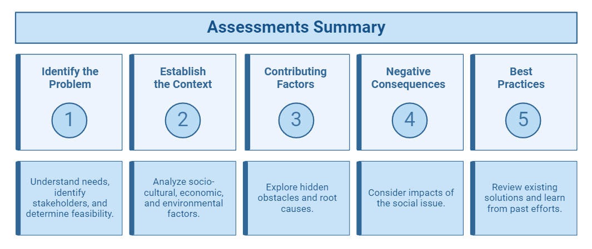
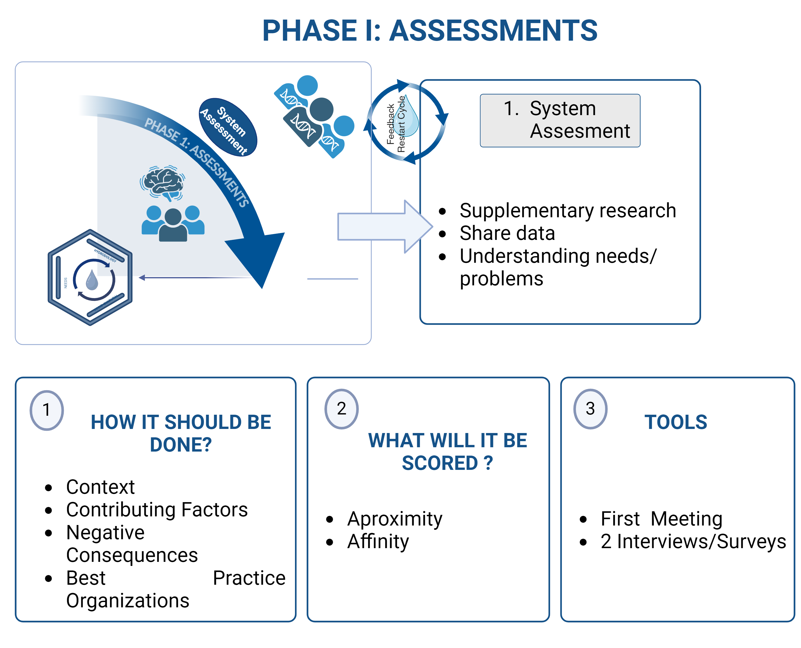

<h2><strong>Phase I: Assessments</strong></h2>

Our first step is to identify the problems/needs of a specific activity.

<h3><strong>System Assessments</strong></h3>

In this section we will follow some steps:

<ol>
  <li>Identify the Problem</li>

  <li>Context</li>

  <li>Contributing Factors</li>

  <li>Negative Consequences</li>

  <li>Best Practices</li>
</ol>

<h3><strong><em>Identify the Problem</em></strong></h3>

In order to identify the problem, you must begin by understanding the needs of the society and their social issues. A good start is to check beforehand if there is a comprehensive understanding of the social issue, which includes asking a few questions such as:

<ul>
  <li>Are the root causes of the problem clearly defined?</li>

  <li>Is there enough data and research to back up the identified needs?</li>

  <li>Are the stakeholders and their needs accurately identified and consulted?</li>
</ul>

This does not mean learning everything there is to know about the issue at hand, but rather allowing it to be framed in a way that helps us to move forward. In the beginning, all we need is a desire and a willingness to help because there is so much to learn about the problem at hand. As you learn more about the problem, you should take into consideration what the quality and feasibility of the proposed solutions are like. Ask yourself questions like:

<ul>
  <li>Are the solutions designed based on thorough research and stakeholder input?</li>

  <li>Do the solutions align with the identified needs and root causes?</li>

  <li>Is there a clear and practical plan for implementation?</li>
</ul>

Once you've identified the problem you care about, you must then focus on a particular population or geographical area.

<h3><strong><em>Establish Context</em></strong></h3>

Each problem has its roots in a particular sociocultural, economic, and environmental setting. An effective solution in one context might not work in another. In order to comprehend the context of a given problem, we need to consider the five W questions of journalism:

<ul>
  <li>Who?</li>

  <li>What?</li>

  <li>When?</li>

  <li>Where?</li>

  <li>Why?</li>
</ul>

It is important that no matter where these social impact groups are located, the main focus is helping the local community and those that are most affected by the problem at hand.

<h3><strong><em>Understand Contributing Factors</em></strong></h3>

On the surface, many issues can appear effortless with obvious causes and readily apparent solutions. Upon closer examination, we can discover hidden obstacles that when put together, cause our societal problems. Understanding these pieces is crucial, as they can assist us when making decisions, provide insight into the main causes of our issues, and direct us toward potential workable solutions.

<h3><strong><em>Identify Negative Consequences</em></strong></h3>

Negative consequences inspire us to do research that helps us to better understand the issue. Focusing on the various categories that they fit into is helpful when considering the repercussions because it allows us to be specific and clear about the results of the social issue. Observe how every category addresses a distinct aspect of human existence.

<h3><strong><em>Investigate Current Practices</em></strong></h3>

This includes asking yourself:

<ul>
  <li>What is already being done to alleviate the suffering caused by this issue?</li>

  <li>What are the current methods in focus?</li>

  <li>How successful are current interventions?</li>
</ul>

Rather than focusing on designing a new solution or testing your own ideas, you should turn your focus to comparing notes with fellow change-makers that have already spent time dedicated to tackling this issue. We need to examine what has and has not worked, as well as the experiences of those most impacted by the problem as well as those involved in its solution.

<h3><strong>Key Summary of the Section</strong></h3>

*Figure 6. Phase I Steps of System Assessment*

*Figure 7. Phase I Summary*

<h4>What will it be scored?</h4>

more information coming soon

<h3><strong>Check your understanding</strong></h3> 

<!-- question 1 -->

 
What is the most important component to identifying the problem?
<ul style="list-style-type: none;">
    <li>A. Having an easy solution that can be implemented right away</li>
    <li>B. Understanding the needs of the society and their social issues</li>
    <li>C. Explore a problem that has never been explored before</li>
    <li>D. Focusing on financial constraints and budget limitations</li>
    <li>E. Analyzing available technological solutions</li>
 

 

B. Understanding the needs of the society and their social issues

<!-- question 2 -->

Which of the following best describes the importance of establishing context in the assessment process?
<ul style="list-style-type: none;">
    <li>A. It helps to generate a list of potential solutions.</li>
    <li>B. It ensures that problems are framed in a way that makes them easier to address.</li>
    <li>C. It highlights the sociocultural, economic, and environmental factors that affect the problem at hand.</li>
    <li>D. It allows for the exclusion of certain stakeholders from the discussion.</li>
    <li>E. It solely focuses on the historical background of the issue.</li>
</ul>

 
C. It highlights the sociocultural, economic, and environmental factors that affect the problem at hand.

<!-- question 3 -->

 

When assessing a social issue, why is it crucial to understand contributing factors?
<ul style="list-style-type: none;">
    <li>A. They can provide insight into the main causes of societal problems.</li>
    <li>B. They are often unrelated to the problem being addressed.</li>
    <li>C. They are not necessary for developing a practical solution.</li>
    <li>D. They only complicate the assessment process.</li>
    <li>E. They help to establish a timeline for intervention.</li>

 
A. They can provide insight into the main causes of societal problems.

<!-- question 3 -->

 

What is the purpose of investigating current practices when addressing a social issue?
<ul style="list-style-type: none;">    
    <li>A. To determine the financial costs associated with new solutions</li>
    <li>B. To focus solely on developing new solutions without considering past efforts</li>
    <li>C. To learn from existing interventions and understand what has or hasn’t worked</li>
    <li>D. To create a detailed report on stakeholders involved in the problem</li>
    <li>E. To exclude the experiences of those affected by the issue</li>
</ul>

 

C. To learn from existing interventions and understand what has or hasn’t worked

