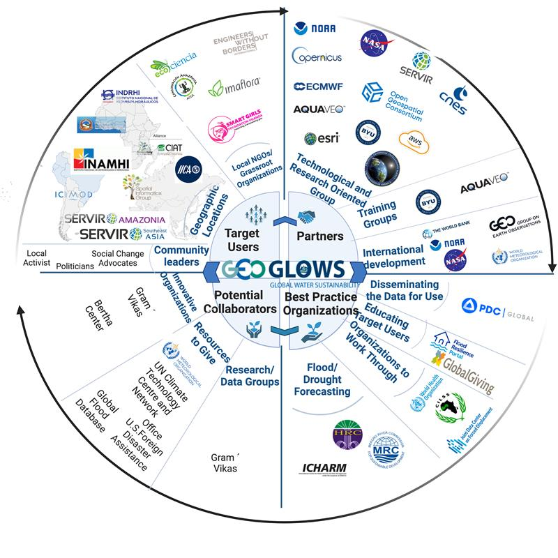
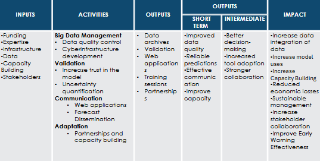

## **Phase II: Planning and Design**

In this phase, we will finalize our goal and propose a plan to best meet these goals. This will be divided into two sections:

1. Goal Setting  
2. Collaborative Design  

### *Goal Setting*

Goal setting is the process of identifying specific objectives that need to be improved and figuring out how your organization can improve this. We can break this down into 5 steps:

1. **Specific** - Is your goal clear and precise?  
2. **Measurable** - How can you track the progress on your goal and will you be able to tell when the goal is achieved?  
3. **Achievable** - Is this goal realistic and attainable given your constraints?  
4. **Relevant** - Is this a meaningful goal that aligns with the broader objectives?  
5. **Time-bound** - What is the deadline?  

### *Collaborative Design*

The term co-creation intervention is a cooperative method of developing and putting into practice ideas or solutions. In this instance, co-creation requires involving stakeholders in the process of problem identification and intervention development, including students, community members, patients, and staff. This is collaborative design, where one can incorporate the thoughts, needs, and expertise of those who are directly affected. The aim is to make sure that the solutions are the most relevant, effective, and sustainable that they can be.

The collaborative design includes two steps: ecosystem map and logic model.

#### **_Ecosystem Map_**

To make ecosystem changes more systematic, this includes identifying all of the key players, environmental conditions, and the relationships among them. Organizations should define their ultimate intended impact and outline the steps they will take to achieve that impact, which involves defining their Social Impact Cycle for Global Model Hydrology. Additionally, they should identify the various components of their ecosystem, including individuals, organizations, and environmental conditions that could influence their ability to effect sustainable change.

*Figure 8. GEOGLOWS Ecosystem Map*

This visual helps identify the various relationships and dynamics within a system, provides a holistic view, and can uncover opportunities or problems that might have gone unnoticed otherwise.

#### **_Logic Model_**

A logic model is a visual representation of a Theory of Change. Typically, it illustrates the inputs, activities, and resulting outputs of an intervention. Logic models are widely used in impact-focused practices, though their format may vary between organizations. The most effective logic models are created through backward mapping.

*Figure 9. GEOGLOWS Logic Model*

This kind of model helps to clarify the goals of the project, enhances communication among stakeholders, and can be a tool in tracking progress.

### **Key Summary of the Section**

*Figure 10. Phase II Summary*

<!--question 1-->

What is the primary focus of the Goal Setting process in Phase II?
<ul style="list-style-type: none;">
    <li>A. To develop financial budgets for the project</li>
    <li>B. To identify specific objectives and how to improve them</li>
    <li>C. To assess the impact of past interventions</li>
    <li>D. To engage stakeholders in the planning process</li>
    <li>E. To finalize the project timeline</li>

  

B. To identify specific objectives and how to improve them

<!--question 2-->

Which of the following is NOT one of the five steps involved in effective goal setting?
<ul style="list-style-type: none;">
    <li>A. Specific</li>
    <li>B. Measurable</li>
    <li>C. Innovative</li>
    <li>D. Relevant</li>
    <li>E. Time-bound</li>

 

C. Innovative

<!--question 3-->

What does the collaborative design phase emphasize in the development of interventions?
<ul style="list-style-type: none;">
    <li>A. Solely relying on expert opinions for solution design</li>
    <li>B. Including stakeholders in the process of problem identification and solution development</li>
    <li>C. Implementing solutions without feedback from the community</li>
    <li>D. Focusing on individual perspectives rather than collective input</li>
    <li>E. Limiting participation to only organizational leaders</li>

 
B. Including stakeholders in the process of problem identification and solution development

<!--question 4-->

What is the purpose of a logic model in the context of collaborative design?
<ul style="list-style-type: none;">
    <li>A. To create a financial overview of the project</li>
    <li>B. To visually represent the Theory of Change, illustrating inputs, activities, and outputs</li>
    <li>C. To summarize stakeholder feedback</li>
    <li>D. To outline the history of past projects</li>
    <li>E. To define the timeline for implementation</li>

 

B. To visually represent the Theory of Change, illustrating inputs, activities, and outputs

