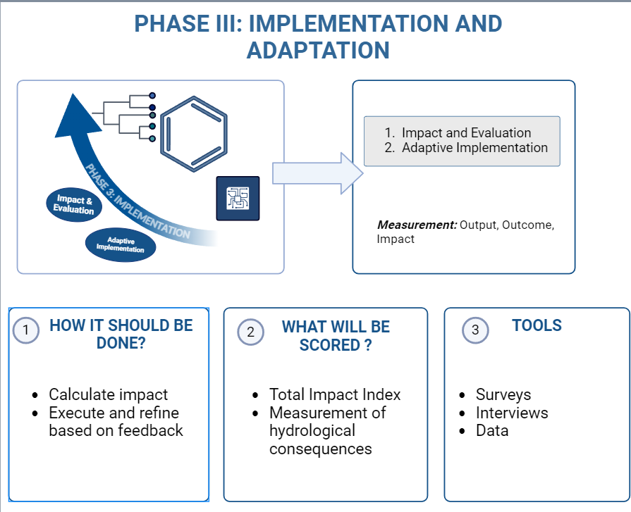

## **Phase III: Implementation and Adaptation**

### Capacity Building

#### Evaluation Impact

Evaluation Impact is a measurement of the portion of a hydrological outcome that is caused by a specific intervention or practice. For example:  
*"Our watershed management practices contributed to a 2% reduction in flood frequency, within an overall 5% reduction observed in the GEOGLOWS hydrological forecasts."*

There are two things to note about this definition:

1. First, to calculate impact, GEOGLOWS must measure the outcomes of negative hydrological consequences (such as flood damage, water scarcity, etc.) based on their intervention practices. The goal is to capture a comprehensive dataset that reflects the actual changes in hydrological conditions due to these interventions.  
2. Second, the hydrological model needs to measure the outcomes of negative hydrological consequences for populations similar to GEOGLOWS’ customers who do not engage in GEOGLOWS’ intervention practices.  

The differences between these two outcomes represent the positive or negative impact caused by GEOGLOWS.  

Impact is always linked to causation: *What portion of GEOGLOWS’ outcomes are caused by its intervention?*

### **Measuring Impact**

#### How do I assess if my solution is working?

To assess if your solution is working, collect data and analyze feedback from the community and users. This can include:  
- Surveys and interviews conducted before and after implementation.  
- Observations.  
- Existing and resulting data.  

To determine the impact of an intervention, we will use a composite index called the **Total Impact Index**.

The Total Impact Index is a composite measure that shows the impact related to the implementation and adaptation of GEOGLOWS using different indexes for various activities. Each individual component will be scored on a scale from 0–100, and the weight of each index will be based on its relative importance.

#### **Equation:**

The higher the score, the greater the positive impact of the GEOGLOWS Model. It also highlights areas for improvement and helps in creating a plan to increase the overall impact.

### **Key Summary of the Section**

  
*Figure 11. Phase III Summary*
