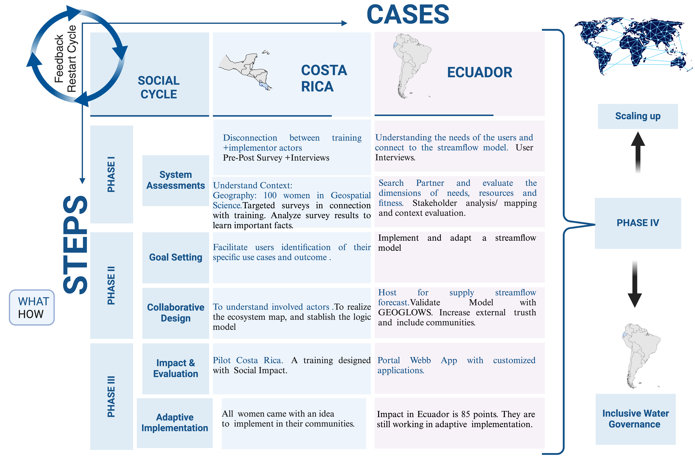

## **Phase IV: Expansion and Equity**

### **How can we scale up?**

In this phase, efforts are focused on scaling successful practices to new areas while ensuring equitable and inclusive water governance. 

**Scaling Up** involves replicating proven strategies in other countries or regions, drawing lessons from previous successes and challenges to refine implementation. This approach enhances the ability to sustain benefits across diverse contexts.

**Inclusive Water Governance** ensures that model benefits are accessible to all, emphasizing the importance of inviting and collaborating with stakeholders within the country. This inclusivity promotes long-term sustainability by fostering collective ownership and support.

Examples of these efforts include use cases from **Costa Rica** and **Ecuador**, where lessons learned from these experiences are applied to expand initiatives. By combining scaling strategies with inclusive governance, the phase aims to create a robust and adaptable framework for water management, benefiting a broader range of communities and stakeholders.

  
*Figure 12. Use Cases for Costa Rica and Ecuador*

### **Key Summary of the Section**

.png)
*Figure 13. Phase IV Summary*