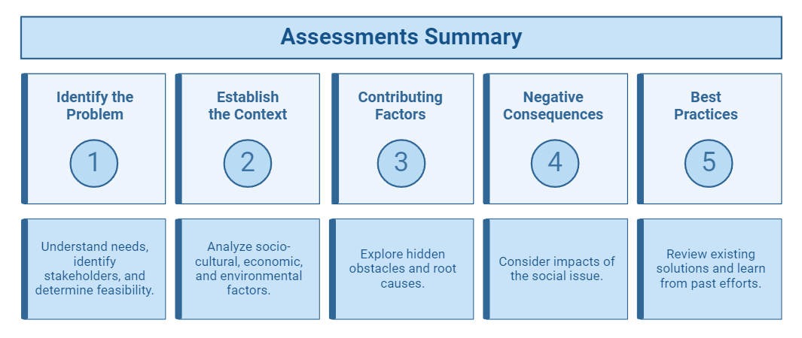
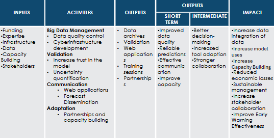
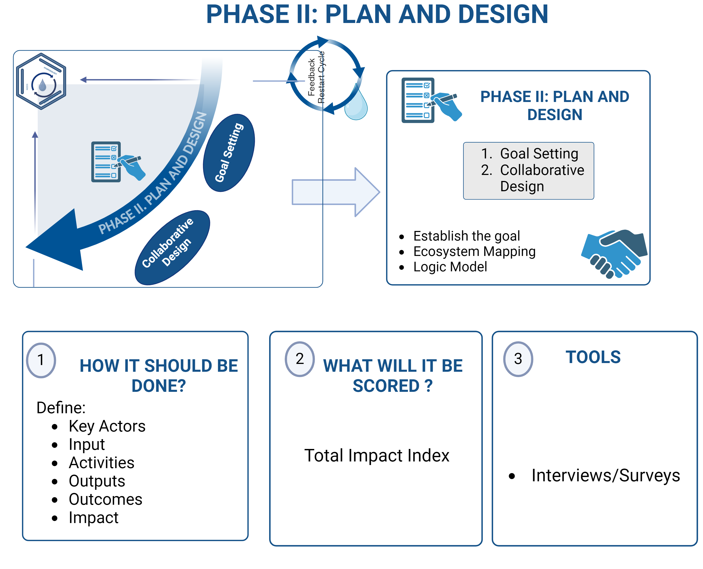
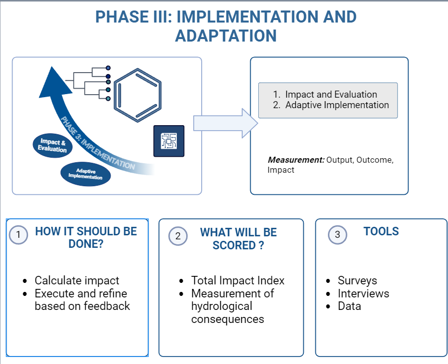

## **Phase I: Assessments**

Our first step is  to identify the problems/needs of a specific activity.

**System Assessments**

In this section we will follow some steps: 

1. Identify the Problem
2. Context
3. Contributing Factors 
4. Negative Consequences 
5. Best Practices 

### **_Identify the Problem_**

In order to identify the problem, you must begin by understanding the needs of the society and their social issues. A good start is to check beforehand if there is a comprehensive understand of the social issue, which includes asking a few questions such as:

- Are the root causes of the problem clearly defined?
- Is there enough data and research to back up the identified needs?
- Are the stakeholders and their needs accurately identified and consulted?

This does not mean learning everything there is to know about the issue at hand, but rather allowing it to be framed in a way that helps us to move forward. In the beginning, all we need is a desire and a willingness to help, because there is so much to learn about the problem at hand. As you learn more about the problem, you should take into consideration what the quality and feasibility of the proposed solutions are like. Ask yourself questions like:

- Are the solutions designed based on thorough research and stakeholder input?
- Do the solutions align with the identified needs and root causes?
- Is there a clear and practical plan for implementation?

Once you've identified the problem you care about, you must then focus on a particular population or geographical area.

### **_Establish Context_**

Each problem has its roots in a particular sociocultural, economic, and environmental setting. An effective solution in one context might not work in another. In order to comprehend the context of a given problem, we need to consider the five W questions of journalism:

- Who?
- What?
- When?
- Where?
- Why?

It is important that no matter where these social impact groups are located, that the main focus is helping the local community and those that are most affected by the problem at hand.

### **_Understand Contributing Factors_**

On the surface, many issues can appear effortless with obvious causes and readily apparent solutions. Upon closer examination, we can discover hidden obstacles that when put together, cause our societal problems. Understanding these pieces is crucial, as they can assist us when making decisions, provide insight into the main causes of our issues, and direct us toward potential workable solutions.

### **_Identify Negative Consequences_**

Negative consequences inspire us to do research that helps us to better understand the issue. Focusing on the various categories that they fit into is helpful when considering the repercussions because it allows us to be specific and clear about the results of the social issue. Observe how every category addresses a distinct aspect of human existence.

### **_Investigate Current Practices_**

This includes asking yourself: - What is already being done to alleviate the suffering caused by this issue? - What are the current methods in focus? - How successful are current interventions?

Rather than focusing on designing a new solution or testing your own ideas, you should turn your focus to comparing notes with fellow change makers that have already spent time dedicated to tackling this issue. We need to examine what has and has not worked, as well as the experiences of those most impacted by the problem as well as those involved in its solution.

### **KEY SUMMARY OF THE SECTION**

#### What will it be scored?

more information coming soon

## **Phase II: Planning and Design**

In this phase, we will finalize our goal and propose a plan to best meet these goals. This will be divided into two section:

1. Goal Setting
2. Collaborative Design

### **_Goal Setting_**

### **_Collaborative Design_**

The term co-creation intervention is a cooperative method of developing and putting into practice ideas or solutions. In this instance, co-creation requires involving stakeholders in the process of problem identification and intervention development, including students, community members, patients, and staff. This is collaborative design, where one can incorporate the thoughts, needs, and expertise of those who are directly affected, the aim is to make sure that the solutions are the most relevant, effective, and sustainable that they can be.

The collaborative design includes two steps: ecosystem map and logic model.

**_Ecosystem Map_**

To make ecosystem changes more systematic which includes identifying all of the key players, environmental conditions, and the relationships among them. They should define their organization’s ultimate intended impact and outline the steps they will take in order to achieve that impact, which is defining their Social Impact Cycle for Global Model Hydrology . Additionally, they should identify the various components of their ecosystem, including individuals, organizations, and environmental conditions that could influence their ability to effect sustainable change.

Figure 6. GEOGLOWS Ecosystem Map

This visual helps identify the various relationships and dynamics within a system, helps to provide a holistic view, and can uncover opportunities or problems that might have gone unnoticed otherwise. 

**_Logic Model_**

A logic model is a visual representation of a Theory of Change. Typically, it illustrates the inputs, activities, and resulting outputs of an intervention. Logic models are widely used in impact-focused practices, though their format may vary between organizations. The most effective logic models are created through backward mapping.

Figure 7. GEOGLOWS Logic Model

This kind of model helps to clarify the goals of the porject, enhances communication among stakeholders, and can be a tool in tracking progress. 

### **KEY SUMMARY OF THE SECTION**

## **Phase III: Implementation and Adaptation**

### **_Capacity Building_**

**Evaluation**

**Impact** is a measurement of the portion of a hydrological outcome that is caused by a specific intervention or practice. For example: "Our watershed management practices contributed to a 2% reduction in flood frequency, within an overall 5% reduction observed in the GEOGLOWS hydrological forecasts"

There are two things to note about this definition:

1. First, to calculate impact, GEOGLOWS must measure the outcomes of negative hydrological consequences (such as flood damage, water scarcity, etc.) based on their intervention practices. The goal is to capture a comprehensive dataset that reflects the actual changes in hydrological conditions due to these interventions.

2. Second, the hydrological model needs to measure the outcomes of negative hydrological consequences for populations similar to GEOGLOWS’ customers who do not engage in GEOGLOWS’ intervention practices.

The differences between these two outcomes is the positive or negative impact caused by GEOGLOWS.

Impact is always linked to causation: What portion of GEOGLOWS’ outcomes are caused by its intervention?

**Measuring Impact: How do I assess if my solution is working?**

To assess if your solution is working is through collecting data and analyzing what the community and the users have to say about it. This can consist of surveys and interviews before and after implementation, observations, and the existing and resulting data.

To determine the impact of an intervention, we will use a composite index called Total Impact Index. 

The Total Impact Index is a composite index that shows the impact related to the implementation and adaptation of GEOGLOWS using different indexes for different activities. Each individual component will be scored ranging on a scale from 0-100 and the weight of each index will be based on their relative importance. 

_Equation_:

_Score_

The higher the score, the higher the positive impact of the GEOGLOWs Model, while still showing the room for improvement and helps to provide a plan to increase the impact. 

### **KEY SUMMARY OF THE SECTION**

## **Phase IV: Expansion and Equity**

more coming soon....

