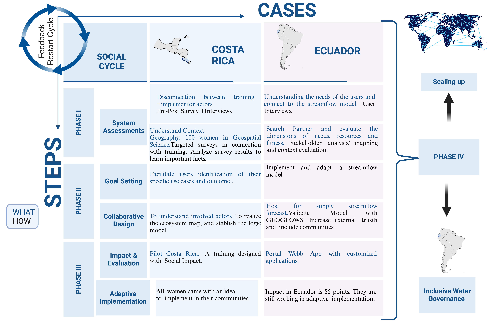

 <button class="tablinks" onclick="openPhase(event, 'Phase1')">Phase 1</button>
  <button class="tablinks" onclick="openPhase(event, 'Phase2')">Phase 2</button>
  <button class="tablinks" onclick="openPhase(event, 'Phase3')">Phase 3</button>
  <button class="tablinks" onclick="openPhase(event, 'Phase4')">Phase 4</button>

<h3 id="Phase4" class="tabcontent">

<h2><strong>Phase IV: Expansion and Equity</strong><h2>

<h3><strong>How can we scale up?</strong></h3>

In this phase, efforts are focused on scaling successful practices to new areas while ensuring equitable and inclusive water governance. Scaling Up involves replicating proven strategies in other countries or regions, drawing lessons from previous successes and challenges to refine implementation. This approach enhances the ability to sustain benefits across diverse contexts.

Inclusive Water Governance ensures that model benefits are accessible to all, emphasizing the importance of inviting and collaborating with stakeholders within the country. This inclusivity promotes long-term sustainability by fostering collective ownership and support.

Examples of these efforts include use cases from Costa Rica and Ecuador, where lessons learned from these experiences are applied to expand initiatives. By combining scaling strategies with inclusive governance, the phase aims to create a robust and adaptable framework for water management, benefiting a broader range of communities and stakeholders.

Figure 12. Use Cases for Costa Rica and Ecuador

